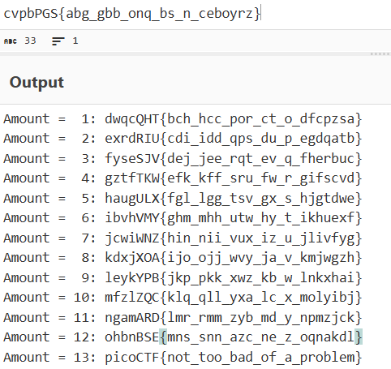

# 13

> Cryptography can be easy, do you know what ROT13 is? cvpbPGS{abg\_gbb\_onq\_bs\_n\_ceboyrz}

## About The Challenge

We were given the encoding text: cvpbPGS{abg\_gbb\_onq\_bs\_n\_ceboyrz} and the hints "ROT13"

## How To Solve

1. I used ROT13 Brute Force to decode the text and the flag is shown.

(Recommended Website: [CyberChef](https://gchq.github.io/CyberChef/#recipe=ROT13_Brute_Force(true,true,false,100,0,true,'')&input=Y3ZwYlBHU3thYmdfZ2JiX29ucV9ic19uX2NlYm95cnp9))



```
picoCTF{not\_too\_bad\_of\_a\_problem}
```


