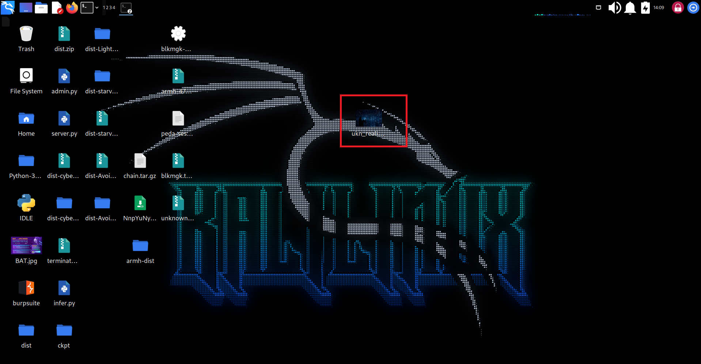
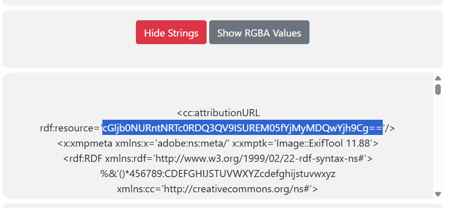

# CanYouSee

>  How about some hide and seek? Download this file [here](https://artifacts.picoctf.net/c_titan/129/unknown.zip).

## About The Challenge

We were given a zip file 'unknown.zip'.

## Used Tools
[StegOnline](https://georgeom.net/StegOnline/upload)
[CyberChef](https://gchq.github.io/CyberChef/#recipe=From_Base64('A-Za-z0-9%2B/%3D',true,false))

## How To Solve

1. Unzip it and get a jpg file inside.


2. This is the image we will see after opening. There is no any text inside.
[preview](Images/preview2.png)

3. This might be a steganography. Using StegOnline tool and upload the image file. Click on 'show strings' to view the strings inside. There is a resource value ‘cGljb0NURntNRTc0RDQ3QV9ISUREM05fYjMyMDQwYjh9Cg==’. It has two == at the last value so it might be a Base64 value.


4. Copy and decode it using Base64 decoder. Then, the flag is shown.
[flag](Images/flag.png)

```
picoCTF{ME74D47A_HIDD3N_b32040b8}

```


