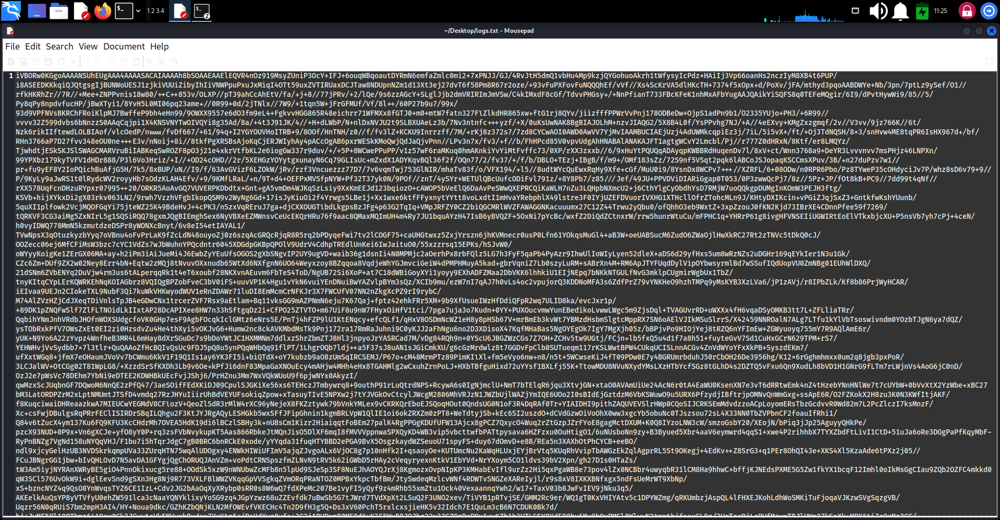
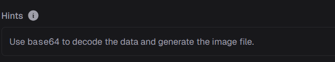
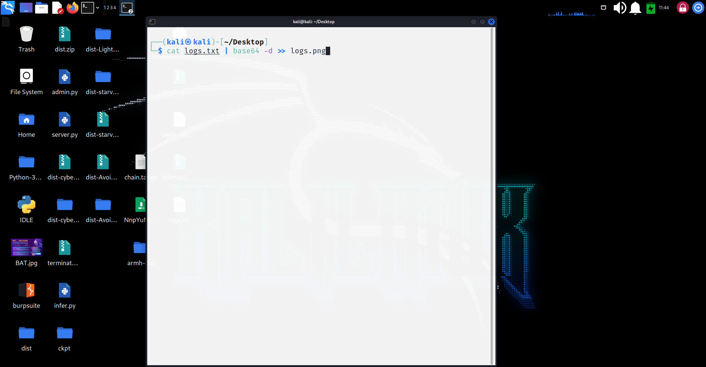
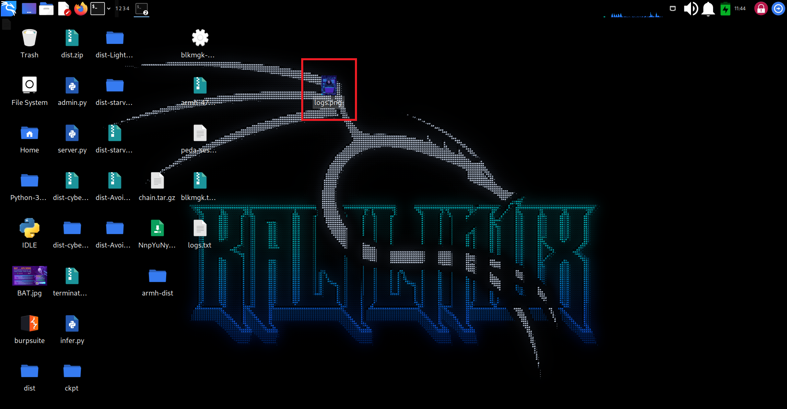
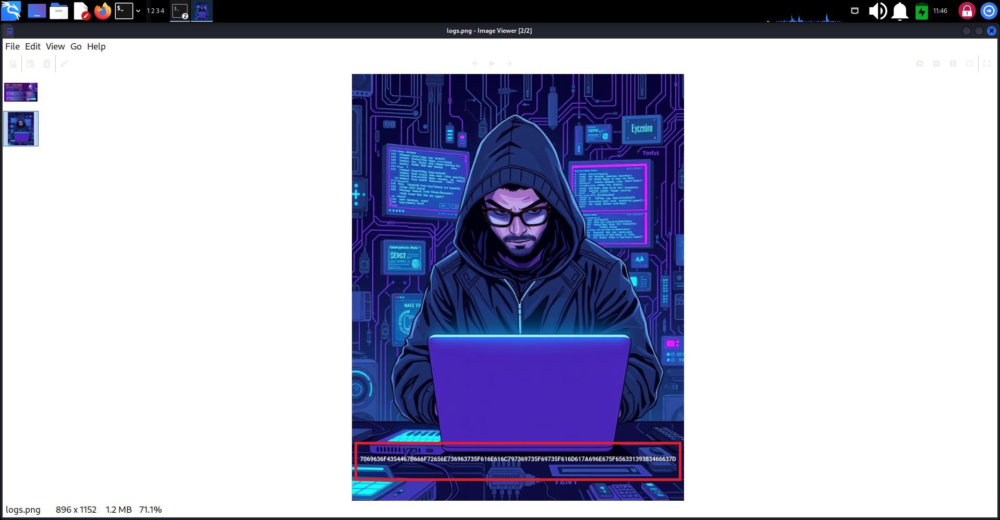
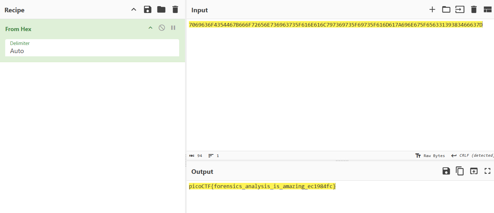

# Flag in Flame

> The SOC team discovered a suspiciously large log file after a recent breach. When they opened it, they found an enormous block of encoded text instead of typical logs. Could there be something hidden within? Your mission is to inspect the resulting file and reveal the real purpose of it. The team is relying on your skills to uncover any concealed information within this unusual log.
Download the encoded data here: . Be prepared—the file is large, and examining it thoroughly is crucial.

## About The Challenge

We were given a Logs.txt file. Download and open it. There are a large amount base64 text inside.


## Used Tools
[CyberChef](https://gchq.github.io/CyberChef/#recipe=From_Hex('Auto')&ieol=CRLF&oeol=CRLF)

## How To Solve

1. There is a hint. It shows “Use base64 to decode the data and generate the image file.”


2. Using ‘cat’ to decode the base64 and transfer it to image.




4. Open this image, we can get a value: 7069636F4354467B666F72656E736963735F616E616C797369735F69735F616D617A696E675F65633139383466637D


5. This value has uppercase and number 0-9. It might be hex value. I decode it and get the flag.



```
picoCTF{forensics_analysis_is_amazing_ec1984fc}
```


