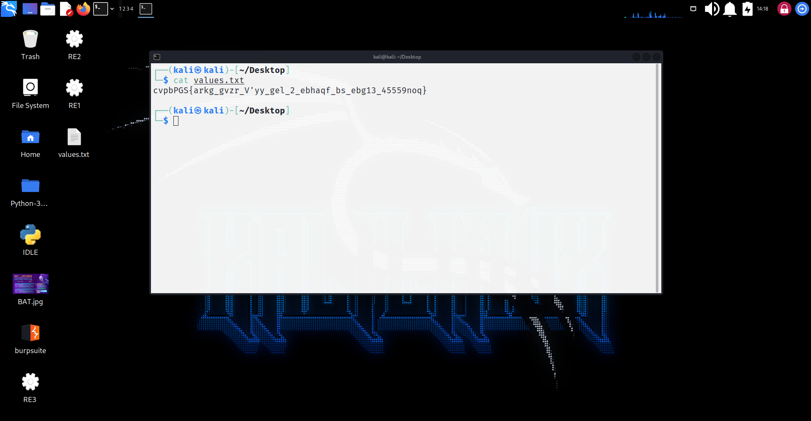
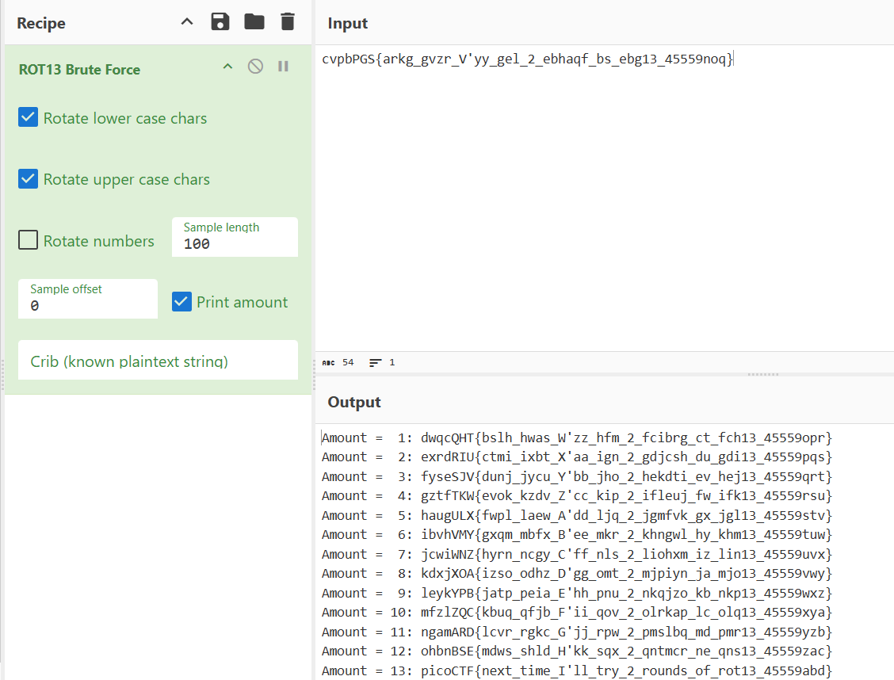

# Mod 26
 

> Cryptography can be easy, do you know what ROT13 is?

## About The Challenge

We were given a text file. Use kali command "cat" to see the content.

## How to Solve?

1. Go to kali. Using "cat values.txt" to see the content inside. You are given a line of words. The format seems like the encoded flag using cipher shift as it just have the numbers with alphabet.


 
2. From the question given, it gives a hint called'ROT13'. To decode these words, I tried using ROT13 brute-force and get the flag.

( [website](https://gchq.github.io/CyberChef/)) 

 

```

picoCTF{next\_time\_I'll\_try\_2\_rounds\_of\_rot13\_45559abd}

``` 
