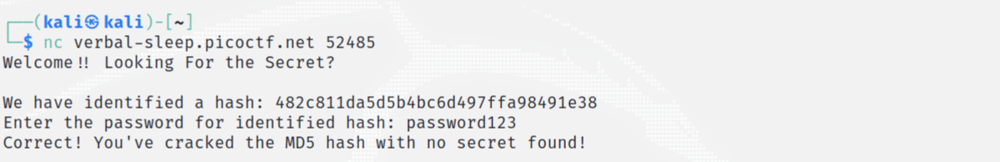
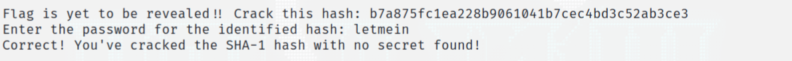
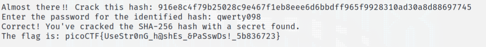

# hashcrack

> A company stored a secret message on a server which got breached due to the admin using weakly hashed passwords. Can you gain access to the secret stored within the server?

## About The Challenge
We were given the server to access.   

 

## How to Solve?
1. When access, I get the first hash value. To decode this hash value, I identified it first and used MD5 to decode it. 
([website](https://www.dcode.fr/hash-identifier): identify the hash value
 [website](https://www.dcode.fr/md5-hash): decode MD5.)



2. After entering the password, I get the second hash value. 
To decode this hash value, I identified and used SHA-1 to decode it. (Recommended [website](https://www.dcode.fr/sha1-hash))



3. I get the third hash value. I used SHA-256 to decode it and get the flag inside.(Recommended [website](https://www.dcode.fr/sha256-hash))



```
picoCTF{UseStr0nG_h@shEs_&PaSswDs!_5b836723}
```


