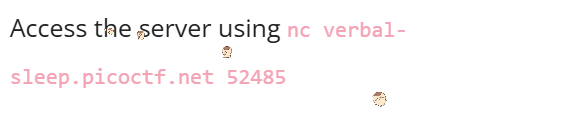
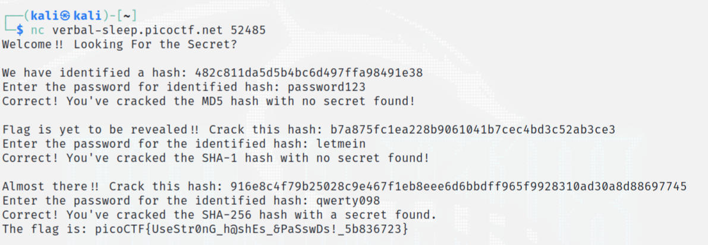

# hashcrack

> A company stored a secret message on a server which got breached due to the admin using weakly hashed passwords. Can you gain access to the secret stored within the server?

## About The Challenge
We were given the server to access.   

 

## How to Solve?
When access, I get the first hash value.

To decode this hash value, I identified it first and used MD5 to decode it. 
(You can use this [website](https://www.dcode.fr/hash-identifier) to identify the hash value and this [website](https://www.dcode.fr/hash-identifier) to decode.)

After entering the first plain text, I get the second hash value. 
To decode this hash value, I identified and used SHA-1 to decode it. 

I get the third hash value. I used SHA-256 to decode it and get the flag inside.



```
picoCTF{UseStr0nG_h@shEs_&PaSswDs!_5b836723}
```


